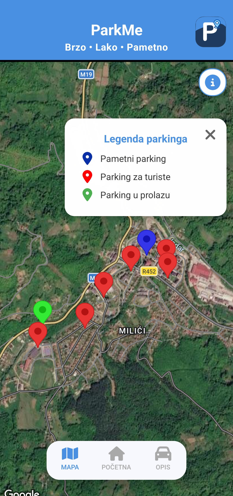
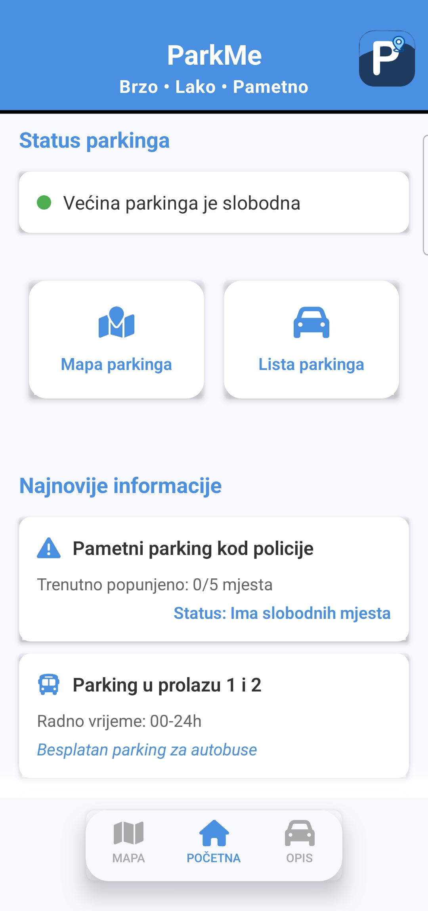
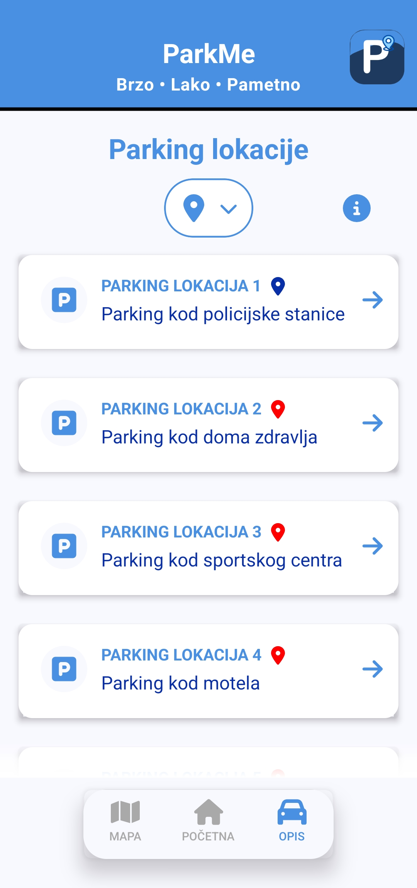
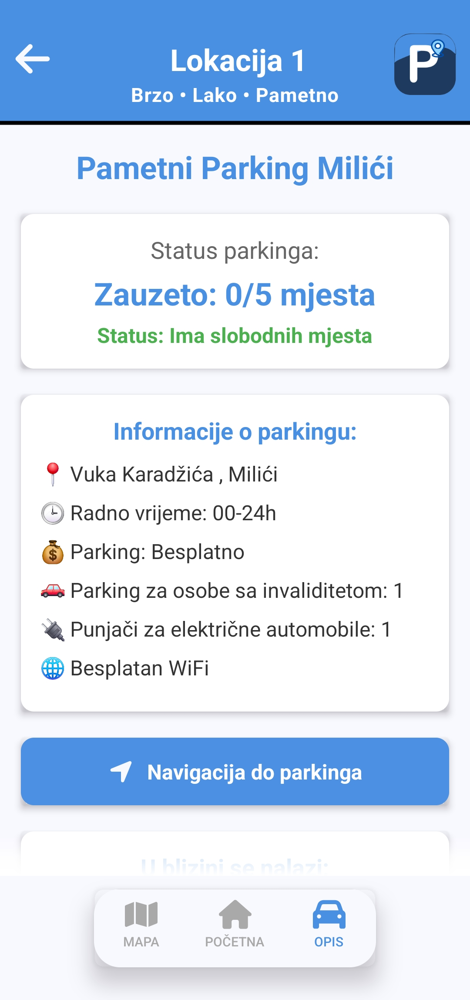
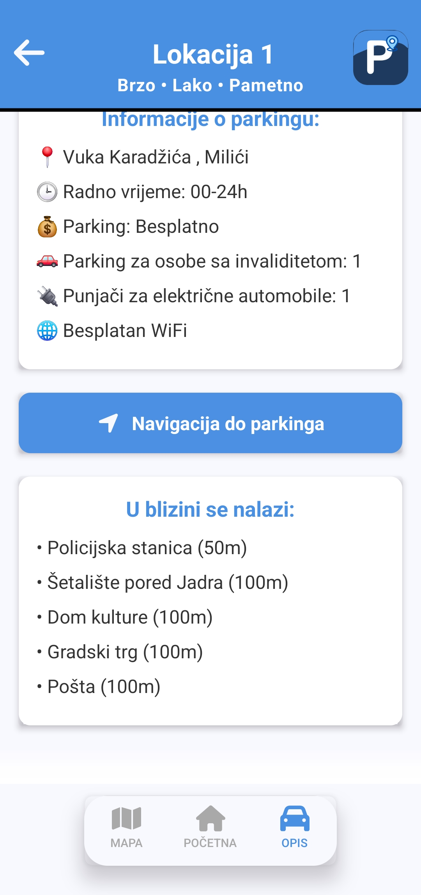

# ParkMe

<p>ParkMe is a smart parking system designed to help users check the number of available parking spaces at a specific parking location before arriving at their destination or while already in the city.</p>
<p>The system combines a React Native mobile application with Firebase and physical parking model built using Arduino Uno, an ESP Wi-Fi module, ultrasonic sensors and servo motor.</p>

## Features

*  View the number of available parking spaces in real time
*  Check the current parking availability before arriving at a location
*  Monitor parking availability while already in the city
*  Receive real-time updates from the physical parking model
*  Automatically control the parking barrier
*  Track the number of occupied parking spaces
*  Prevent vehicles from entering when the parking capacity is reached

## How It Works

The physical parking model communicates with the mobile application through Firebase.

1. An ultrasonic sensor detects a vehicle approaching the parking entrance.
2. The Ultrasonic Sensor detects the vehicle awnd sends teh measured distance to the ESP8266 Wi-Fi module.
3. The ESP module sends the parking status to the Firebase Realtime Database.
4. A servo motor controls the parking barrier based on the current parking state.
5. When a vehicle enters the parking area, the number of occupied spaces is increased.
6. When a vehicle leaves, the number of occupied spaces is decreased.
7. The mobile application receives the updated data from Firebase in real time.
8. When the parking lot reaches its maximum capacity, the entrance barrier remains closed while the exit remains available.

 ## System Architecture

 ```mermaid
flowchart TD
  A[Physical Parking Model] --> B[Ultrasonic Sensors]
  B --> C[ESP 8266 Wi-Fi Module]
  C --> D[Firebase Database]
  D --> E[React Native Mobile Application]
 ```
This allows the mobile application to display the current parking availability based on the real-time state of the physical parking model.

## Technologies

* React Native
* JavaScript
* Firebase
* Arduino Uno
* ESP 8266 Wi-Fi Module
* Ultrasonic Sensors
* Servo Motor

## Screenshots

<p align="center" padding="10">
  
  
</p>

<p align="center" padding="10">
  
  
  
</p>

## Project Demonstration

[▶️ Watch the ParkMe demonstarion on YouTube](https://youtu.be/GiUQYkAQYYE")


## Team Project

ParkMe was developed as a collaborative project of the team "NZ DEVS"

### Contributors

* Vladimir Erić
* Stefan Marinković

## Future Improvements

* Support for multiple parking locations
* Integration with real-world parking infrastructure
* Parking reservation functionality
* User accounts and personalized parking history
* Expansion of the system to support larger parking facilities
